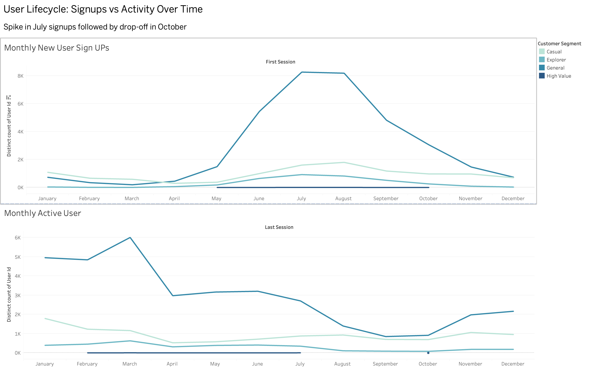
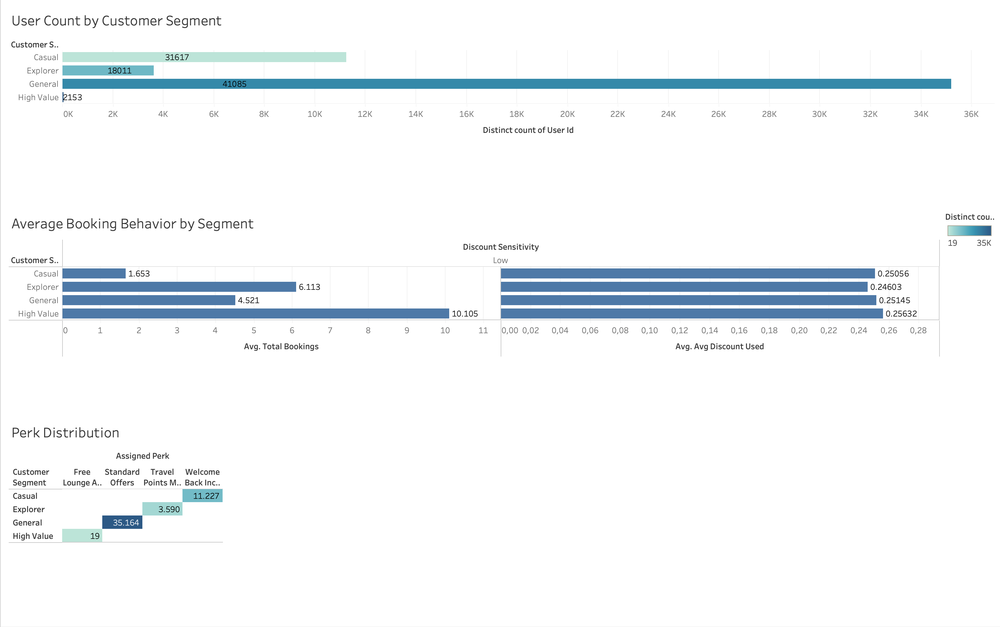

🌊 TravelTide Customer Segmentation & Rewards Analysis

Welcome to the TravelTide Data Analytics Project — an end-to-end SQL-powered analysis designed to support the launch of a targeted customer rewards program.

---

## 📌 Project Objective

Help TravelTide identify customer segments and assign the most appealing perk to each, in order to increase sign-up and engagement with the company’s upcoming **rewards program**.

All analysis is based purely on **SQL**. No Python or Jupyter was used.

---

## 🧠 Business Context

TravelTide is an e-booking startup with best-in-class travel inventory and aggregation tech. Since its launch in April 2021, it's grown rapidly. Marketing wants to personalize reward offers (like free checked bags, meals, or discounts) based on user behavior to increase conversion.

---

## 🗂️ Data Overview

The project uses data from 4 tables:

| Table      | Description                          |
|------------|--------------------------------------|
| `users`    | User demographics & sign-up info     |
| `sessions` | Booking and session activity logs    |
| `flights`  | Flight booking and trip details      |
| `hotels`   | Hotel booking details per trip       |

---

## 🛠️ Tools Used

- **PostgreSQL** (via Beekeeper Studio)
- **SQL** for all data transformations
- **Tableau** for final dashboarding
- **GitHub** for version control, documentation and final presentation

---

## 🧪 Project Phases

### 1. Data Exploration & Cleaning
- Investigated raw tables using SQL
- Cleaned and filtered sessions, removed invalid records
- Created a unified `session_level_enriched` table

### 2. Feature Engineering
- Built new metrics such as:
  - Booking frequency
  - Discount usage
  - Cancellation behavior
  - Perk-related indicators

### 3. Customer Segmentation
- Created behavioral segments using SQL logic (no ML)
- Assigned the best-fitting perk to each segment

### 📥 Dashboard Visuals

The Tableau dashboards below visualize key user behavior patterns, segment characteristics, and the perks most likely to drive rewards program engagement.

#### 1. User Lifecycle: Signups vs Activity Over Time
This view tracks new user sign-ups and active usage trends across customer segments.  
🔍 Key Insight: July saw a large influx of users (especially General and Explorer), followed by a notable drop in October.

---

#### 2. Customer Behavior & Segment Profiles
This dashboard breaks down segment sizes, average bookings, discount sensitivity, and perk assignment.

- **Top Section**: Segment distribution by volume  
- **Middle Section**: Avg. bookings per user & discount usage  
- **Bottom Section**: Perk distribution across segments

🔍 Key Insight:  
- *High Value* users book the most and show slightly lower discount sensitivity  
- *Explorer* segment responds well to “Travel Points”  
- *Casual* segment prefers “Welcome Back” incentives

---

## 📈 SQL Files

Located in the `/sql/` folder:

- [01_exploration.sql](sql/01_exploration.sql)
- [02_cleaning_and_joins.sql](sql/02_cleaning_and_joins.sql)
- [03_feature_engineering.sql](sql/03_aggregated_user_table.sql)
- [04_feature_engineering.sql](sql/04_feature_engineering.sql)
- [05_segmentation.sql](sql/05_segmentation.sql)

---

## 🎯 Final Recommendations

- Use targeted perks to increase sign-up conversion
- Track effectiveness by cluster (A/B test emails)
- Update segments quarterly based on customer behavior

---

## 📘 Summary Report

For a full narrative walkthrough of the project — from cleaning the data to building the Tableau story — read the PDF summary below:

📄 [**TravelTide: A Data Journey into User Segmentation**](summary/TravelTide_User_Segmentation_Summary.pdf)

This document includes:
- Project motivation and goals
- Step-by-step approach (cleaning, feature engineering, segmentation)
- Dashboard design logic
- Final insights and business takeaways

---

## 👤 Author

** Robert Schandert **  
Data Analyst | SQL Enthusiast | Tableau Explorer  

---

Add README.md with project overview and structure
